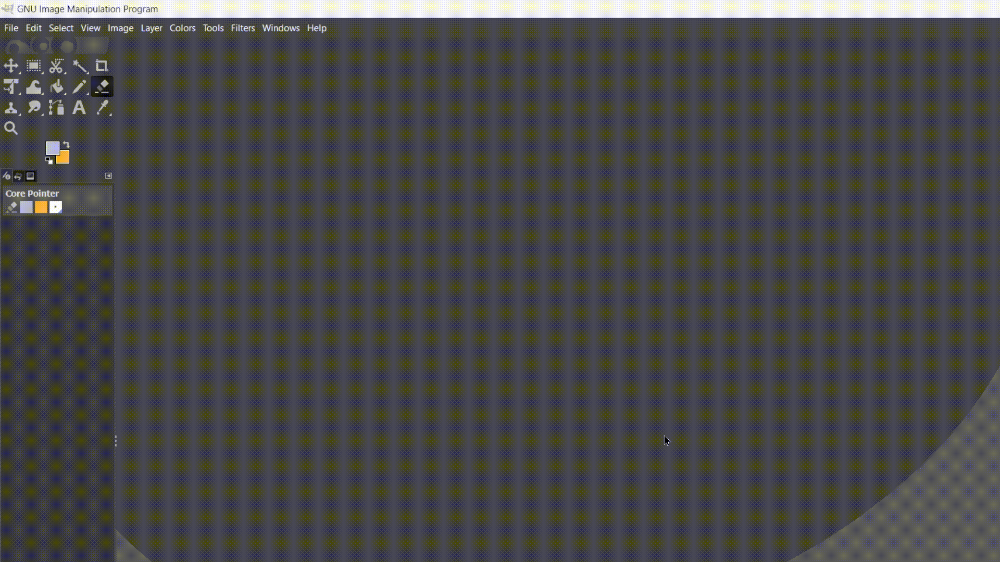
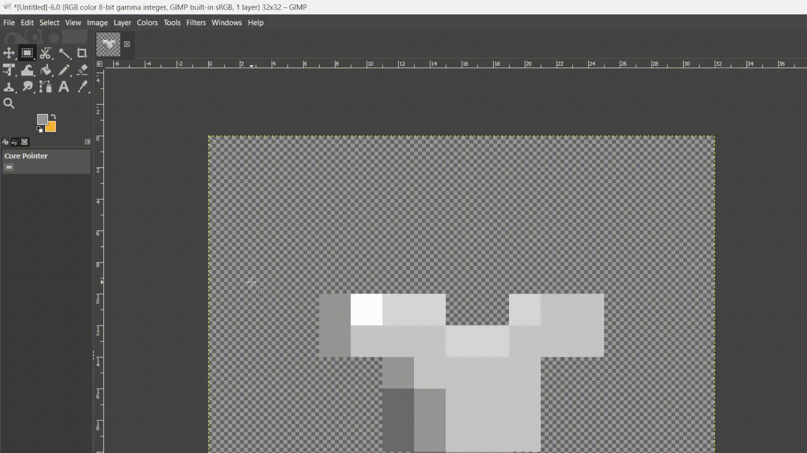

<!-- ---
layout: default
--- -->

# Custom resources in Vanilla Minecraft
## Quick Intro
Minecraft **datapacks** and **resource packs** are **data-driven**, meaning a big part of the game is not **hardcoded**.
For instance, advancements are data-driven, so there's no need to recompile the game to add new ones. A simple `/reload` does the trick.
On top of that, it enables merging many game modifications seamlessly.
As a developper, it's a lot **quicker** and **easier** to broaden the game's data-driven contents rather than diving head first into the source code.<br>
But Vanilla Minecraft limits us to a given set of resources (aka registries), which can be found on [Misode's Generators](https://misode.github.io/generators/) (huge thanks to him !)<br>
Always wanting to make my code as extensible as possible, I went on a journey to find the best way to add custom resources. Here's a step-by-step guide on how to do it.
## Requirements
- Basic datapack knowledge (check out [Quackleb's beginner tutorial](https://www.youtube.com/watch?v=E0BLq5Ll37c))
- Python installed on your device (check out [Python Programmer's tutorial](https://www.youtube.com/watch?v=YKSpANU8jPE))
- [Beet](https://mcbeet.dev) setup (check out [Big Papi's Beet tutorial](https://www.youtube.com/watch?v=IOS-OnqE4GY))
- (Optional) [Visual Studio Code](https://code.visualstudio.com/) for your custom syntax highlighting and folder icons
    - Syntax highlighting: [Spyglass](https://marketplace.visualstudio.com/items?itemName=SPGoding.datapack-language-server) 
    - Custom folder & file icons : [Datapack Icons](https://marketplace.visualstudio.com/items?itemName=SuperAnt.mc-dp-icons)


## Custom File & Folder icons
- Install the [Datapack Icons](https://marketplace.visualstudio.com/items?itemName=SuperAnt.mc-dp-icons) extension.
- Go to the extensions  folder (e.g run `Extensions: Open Extensions Folder` in the VS code commands, or manually open `C:\Users\<USER_NAME>\.vscode\extensions`)
- Navigate to `superant.mc-dp-icons-4.0.2\fileicons\`
### Create new icons
We're now going to create the SVG files that the extension will display allongside our folder names. I'll be using [GIMP](https://www.gimp.org/downloads/)
- Create a 32x32 pixel art (Consider taking inspiration from the [assets repo](https://github.com/FuncFusion/mc-dp-icons-assets) !)

- Crop it according to the contents
- Upscale it to a 32:1000 ratio
- Save it somewhere

- Convert it to an SVG, e.g with [png2svg](https://png2svg.com/)
- Save the svg at `fileicons\imgs\<NAME>_file.svg`
### Declare new icons
Now, let's tell the extension when to display this SVG.
- Head to `fileicons\mc-dp-icon-theme-default.json`
- In the `iconDefinitions` field, add `"<NAME>_file": {"iconPath": "./imgs/<NAME>_file.svg"},`
- In the `fileExtensions` field, add `"<NAME>/json": "<NAME>_file",`
<br>You can follow these steps again to customize the icon of your custom resource folder.
<br>Your theme file should look like this now:

```json
{
  "iconDefinitions": {
    "my_armor": {"iconPath": "./imgs/my_armor.svg"},
    "my_armor_file": {"iconPath": "./imgs/my_armor_file.svg"},
    ...
  },
  "file": "misc",
  "folder": "folder",
  "folderExpanded": "folder_open",
  "folderNames": {
    "data": "data",
    "assets": "assets",
    "src": "src"
  },
  "folderNamesExpanded": {
    "my_armor": "my_armor",
    ...
  },
  "fileExtensions": {
    "my_armor/json": "my_armor_file",
    ...
  },
  "fileNames": { ... },
  "hidesExplorerArrows": ...
}
```

You might also want to enable the `mc-dp-icons.enableSubfolderIcons` setting to, well, enable sub-folder icons.<br>
## Thanks
- [Beet team](https://github.com/mcbeet/beet/graphs/contributors) for making this possible in the first place<br>
- [Spyglass team](https://github.com/SpyglassMC/Spyglass/graphs/contributors) for making such a flexible datapack extension<br>
- [FuncFusion team](https://github.com/FuncFusion) for their datapack icons extension and their help for making this guide